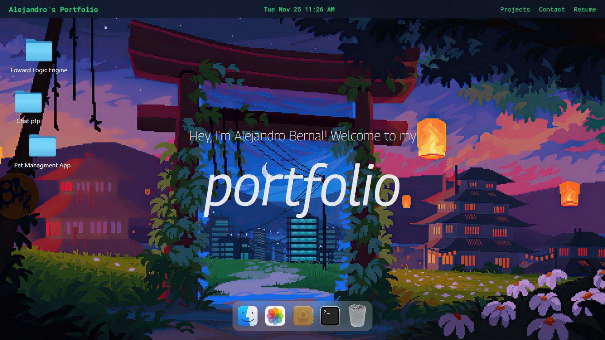

# 💻 macOS Portfolio  
**Interactive macOS-like Desktop Simulation — Built with React**  


---



## 🍏 About the Project

This project is a **web portfolio** that simulates the **macOS desktop experience**, including:

- Animated Dock  
- Draggable windows  
- Simulated apps (Finder, Terminal, Settings, etc.)  
- Smooth transitions  

---

## 🚀 Tech Stack

- **React 18** – Main UI framework  
- **TailwindCSS** – Fast, responsive styling  
- **GSAP** – Smooth animations for Dock & windows  
- **Zustand** – Lightweight global state management  
- **Vite** – Ultra-fast bundler  

---

## 📦 Installation & Usage

Clone the repo and install dependencies:
```bash
git clone https://github.com/Mucca03/macOS_Portfolio
cd macOS_Portfolio
```

Install dependencies:
```
npm install
```

Start the development server:

```
npm run dev
```
